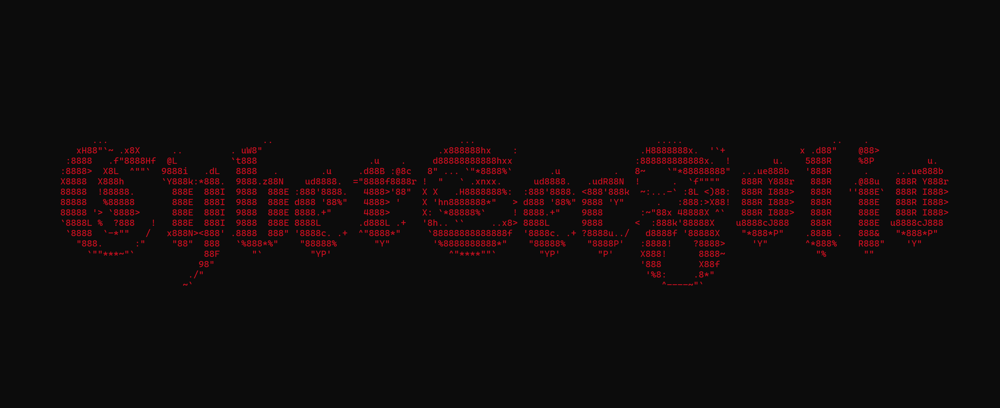

CyberSecFolio hosts an extensive collection of PDF versions of threat and security research blogs, alongside meticulously curated proof-of-concepts for high-profile security vulnerabilities.

## Blogs ##
This directory contains cybersecurity related blogs in PDF format. Research blogs are divided into the following categories:
* [Threat](https://github.com/gothburz/CyberSecFolio/tree/main/blogs/threat-research)
  * These blogs focus on campaigns, threat actors, and threat intel/indicators of compromise.
* [Vulnerability](https://github.com/gothburz/CyberSecFolio/tree/main/blogs/vulnerability-research)
  * These blogs focus on the technical details around specific vulnerabilities.
* [Malware](https://github.com/gothburz/CyberSecFolio/tree/main/blogs/malware-research)
  * These blogs focus on the technical details around specific malware.

There may be some overlap between these three research categories but the goal is to divide high quality blogs into their cybersecurity domain. These blogs contain first-hand research sources, the aim is to aggregate the best technically dense research blogs into one location. 
